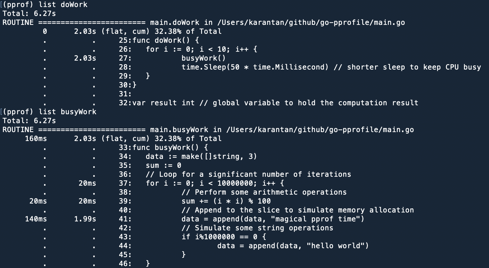

# go-pprofile
Sandbox for testing code profiling with pprof

## Explanation

1. **File Creation**: The program creates a file named cpu.prof to store the profiling data.
1. **Starting Profiling**: pprof.StartCPUProfile(f) begins recording CPU usage.
1. **Workload**: Functions like doWork() and busyWork() simulate some operations whose CPU usage will be profiled.
1. **Stopping Profiling**: The deferred call to pprof.StopCPUProfile() ensures that profiling stops when the program ends.

## Running the Program and Generating the Profile

Compile and run your program:

```bash
go run main.go
```

This generates a cpu.prof file containing the CPU profile data. Make sure cpu.prof exists in your working directory.

## Analyzing the pprof Results
Go provides the go tool pprof command to analyze the profiling data.

Start the pprof Interactive Shell:

Run:

```bash
go tool pprof cpu.prof
```
This will open an interactive shell where you can use several commands.

Common pprof Commands:

`top`: Displays the top functions consuming the most CPU.
```
(pprof) top
```


`list <functionName>`: Shows annotated source code for a specific function, highlighting the time spent on each line.

```
(pprof) list busyWork
```

You can also do `list main` and then look from top down.


### pprof output

Using the `list <funcName>` command, you can view the annotated source code for that function, which highlights the lines where your program spends the most execution time.

Example:



**Flat Time**: This is the time spent executing the code directly in that function, not including any time spent in functions that it calls.

**Cumulative (Cum) Time**: This includes the time spent in the function itself plus all the time spent in its callees. It’s a measure of the total time "accumulated" by that function’s call tree.

For example, if function A calls function B, and function B takes some time to execute, the flat time for A would only include the work it does itself, while the cumulative time for A would include both its own work and the time spent in B.
